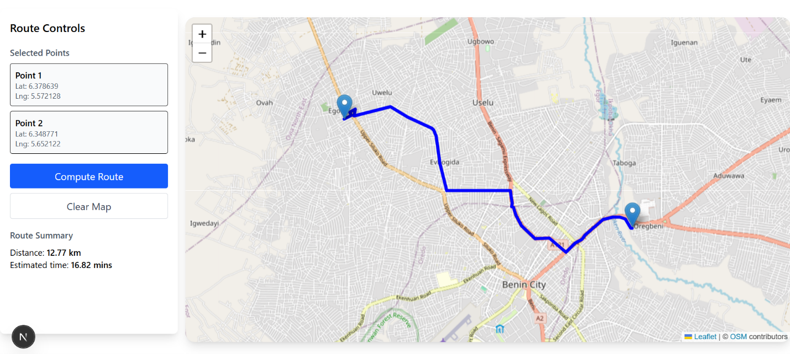
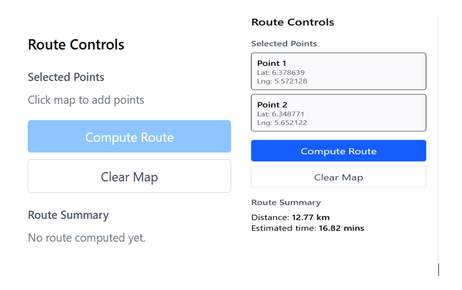
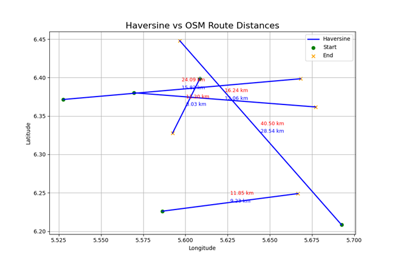

# 🚗 Route Optimizer – Benin City Logistics

A web-based route optimization tool that computes realistic driving routes between user-selected points in Benin City using OpenStreetMap road network data and the OpenRouteService (ORS) API. Built with Next.js, TypeScript, Leaflet, and TailwindCSS.



---

## 📌 Overview

Straight-line (geodesic) distances are poor proxies for actual road travel in urban areas. This system solves that problem by:

- Accepting origin and destination points via map clicks
- Requesting a shortest driving path from the ORS `driving-car` endpoint
- Rendering the route as a polyline on an interactive Leaflet map
- Displaying route distance (km) and estimated travel time (minutes) in a sidebar

The application is stateless, client-side, and uses only the ORS API as an external service.

---

## 🧰 Tech Stack

| Component          | Technology                               |
|--------------------|------------------------------------------|
| Frontend framework | Next.js (App Router) + TypeScript        |
| Styling            | TailwindCSS                              |
| Map rendering      | Leaflet.js + OpenStreetMap tiles         |
| Routing engine     | OpenRouteService (ORS) API               |
| API key storage    | `.env.local` (environment variable)      |

---

## ✨ Key Features

- **Interactive point selection** – Click on the map to set start and end points (only two active points at a time)
- **Real road routing** – Routes follow actual streets, respecting one-way roads and turn restrictions
- **Dynamic feedback** – Distance and travel time update automatically when a route is computed
- **Clear map** – One-click removal of all markers and route layers
- **Responsive layout** – Works on desktop and tablet

---

## ⚙️ How It Works

1. User clicks two locations on the map
2. Coordinates are sent to the ORS API
3. ORS returns a GeoJSON route with distance (meters) and duration (seconds)
4. The frontend converts distance to kilometers and duration to minutes
5. The route is drawn as a blue polyline
6. The sidebar displays the summary and selected points



---

## 📊 Validation & Accuracy

To verify the realism of computed routes, i compared **ORS driving distances** with **straight-line geodesic distances** calculated using the **Haversine formula**:

$$
d = 2R \cdot \arcsin\left(\sqrt{\sin^2\left(\frac{\Delta\phi}{2}\right) + \cos\phi_1 \cos\phi_2 \sin^2\left(\frac{\Delta\lambda}{2}\right)}\right)
$$

where \(R = 6371\) km (mean Earth radius), \(\phi\) is latitude, \(\lambda\) is longitude in radians.

### 📍 Test Results (Benin City)

| Origin → Destination                               | Haversine (km) | ORS Route (km) | Difference (%) |
|----------------------------------------------------|----------------|----------------|----------------|
| (6.380175, 5.569553) → (6.361742, 5.677013)       | 12.05          | 16.24          | +34.8%         |
| (6.398597, 5.608521) → (6.327769, 5.592384)       | 8.08           | 11.20          | +38.6%         |
| (6.371461, 5.527668) → (6.398426, 5.668087)       | 15.80          | 24.09          | +52.5%         |
| (6.208273, 5.692463) → (6.447886, 5.596676)       | 28.67          | 40.50          | +41.3%         |
| (6.226088, 5.586376) → (6.248963, 5.666542)       | 9.22           | 11.85          | +28.5%         |

These differences reflect real-world road constraints such as curves, intersections, and detours. The system consistently returns identical results for identical inputs, confirming reliability.



---

## 🚀 Setup & Deployment

### 1. Clone the repository
```bash
git clone https://github.com/Moses-Kelvin/route-optimizer.git
cd route-optimizer
```

### 2. Install dependencies
```bash
npm install
```

### 3. Get an ORS API key
Sign up at OpenRouteService and copy your API key.

### 4. Set environment variable
Create a `.env.local` file in the root directory:
```env
NEXT_PUBLIC_ORS_API_KEY=your_api_key_here
```

### 5. Run the development server
```bash
npm run dev
```

Visit: http://localhost:3000

---

### 🏗️ Build for production
```bash
npm run build
```

Deploy to Vercel or any Node.js hosting platform.

---

## 📁 Project Structure

```text
├── app/
│   ├── components/
│   │   ├── MapComponent.tsx      # Leaflet map, markers, route drawing
│   │   └── Sidebar.tsx           # Controls and route summary
│   ├── utils/
│   │   └── fetchRoute.ts         # ORS API call
│   └── page.tsx                  # Main page, state management
├── public/                       # Leaflet marker images, etc.
└── .env.local                    # API key (not committed)
```

---

## 🔮 Planned Extensions

- Multi-stop optimization (TSP-style routing for logistics)
- Traffic-aware routing
- Offline map caching
- Time-dependent travel analysis

---

## 🙌 Credits

- OpenStreetMap contributors
- OpenRouteService
- Leaflet.js

---

## 📜 License

MIT License – Free to use and adapt